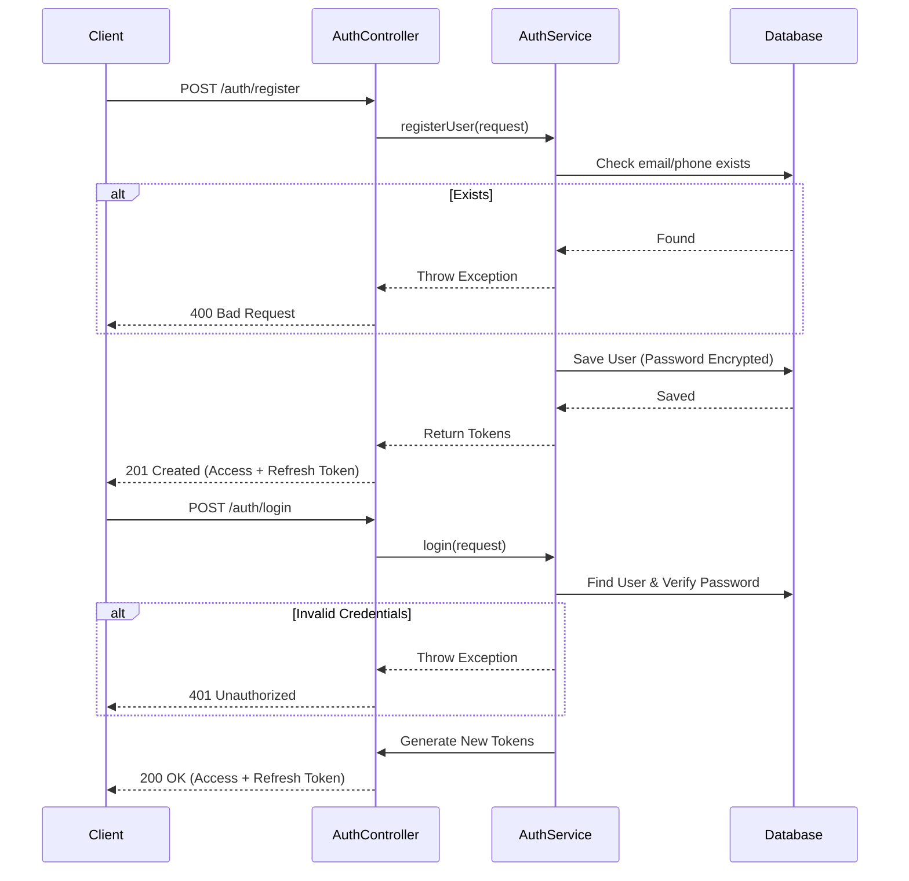
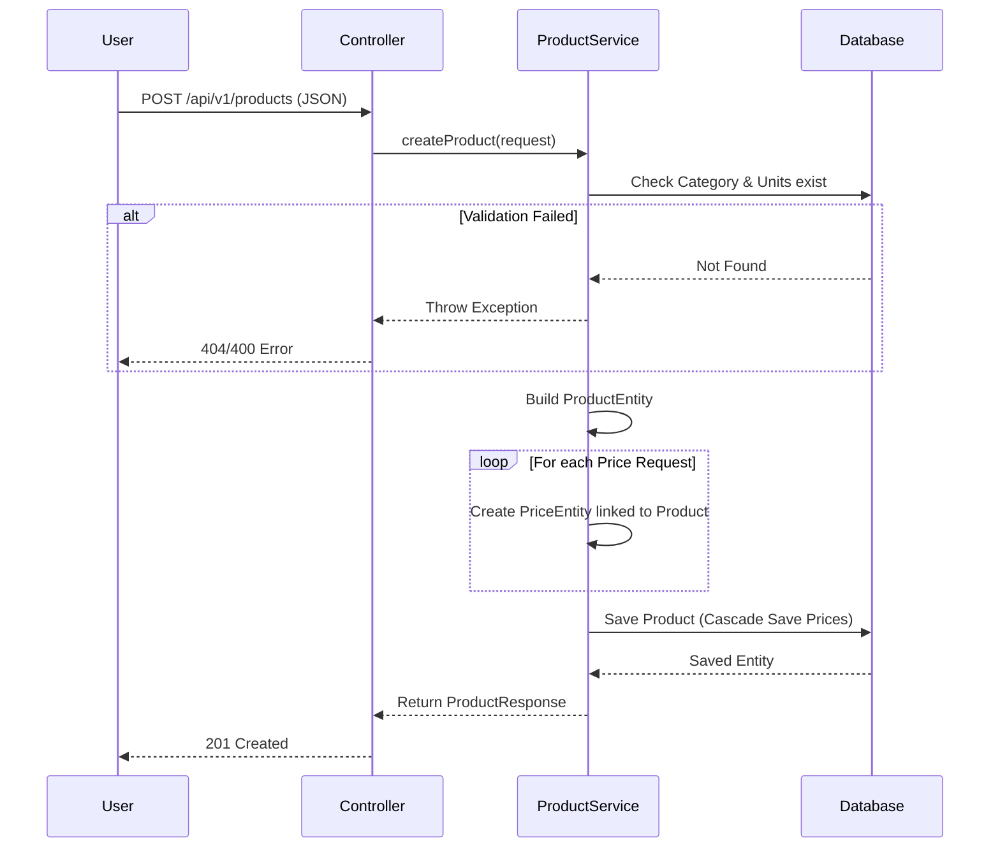

# System Workflows

## 1. Authentication Flow

### 1.1. Registration & Login
Users must register and login to obtain an access token for subsequent requests.

**Endpoints**:
-   `POST /api/v1/auth/register`
-   `POST /api/v1/auth/login`

**Flow Description**:
1.  **User** sends registration details.
2.  **System** validates and creates an account, returning a Token pair (Access + Refresh).
3.  **User** can usually login immediately or use the returned token.
4.  **User** allows sending credentials to `login` endpoint to get new tokens.

### 1.2. Auth Diagram


---

## 2. Product Management Flow

### 2.1. Aggregated Product Creation
This flow allows creating a Product and its associated Prices (variants) in a single transaction.

**Actors**: Admin/Merchant
**Endpoint**: `POST /api/v1/products`

**Sequence**:
1.  **Client** prepares a JSON payload containing:
    *   Product Basic Info (Name, Description, Category, Status).
    *   List of Prices, each linked to a specific `unit_id`.
2.  **Server (ProductController)** validates the request body.
3.  **Server (ProductService)**:
    *   Creates the `ProductEntity`.
    *   Validates existence of `Category` and all `Units`.
    *   Iterates through the price list, creating `PriceEntity` objects linked to the new Product.
    *   Saves everything to the Database in **one transaction**.
4.  **Database**: Inserts 1 row in `products` and N rows in `price`.

### 2.2. Product Creation Diagram


**Example Payload**:
```json
{
  "productName": "Tiger Beer",
  "categoryId": 1,
  "status": 1,
  "prices": [
    { "unit_id": 1, "current_value": 15000, "old_value": 0 },   // Per Can
    { "unit_id": 2, "current_value": 350000, "old_value": 0 }   // Per Case
  ]
}
```

### 2.3. Product Viewing
**Endpoint**: `GET /api/v1/products/{id}`
*   Returns product details.

---

## 3. Entity Relationships
*   **Product** (1) <---> (N) **Price**
*   **Unit** (1) <---> (N) **Price**
*   **Category** (1) <---> (N) **Product**

> **Price** acts as the intersection between specific Products and Units, defining "How much does Product X cost when sold in Unit Y?".
