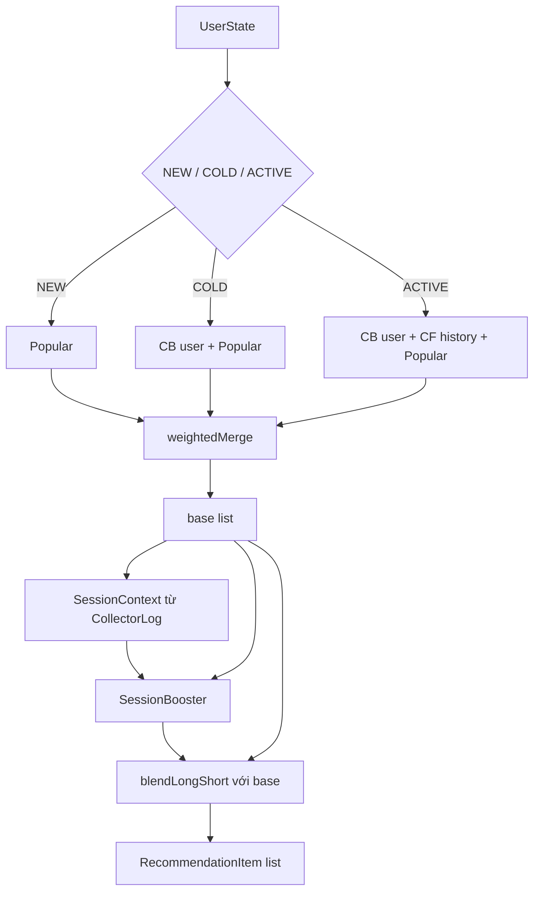
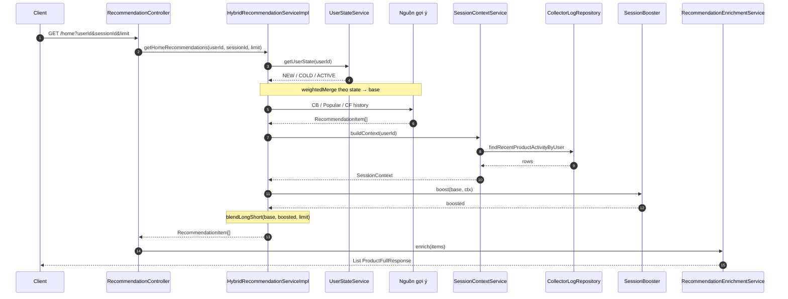
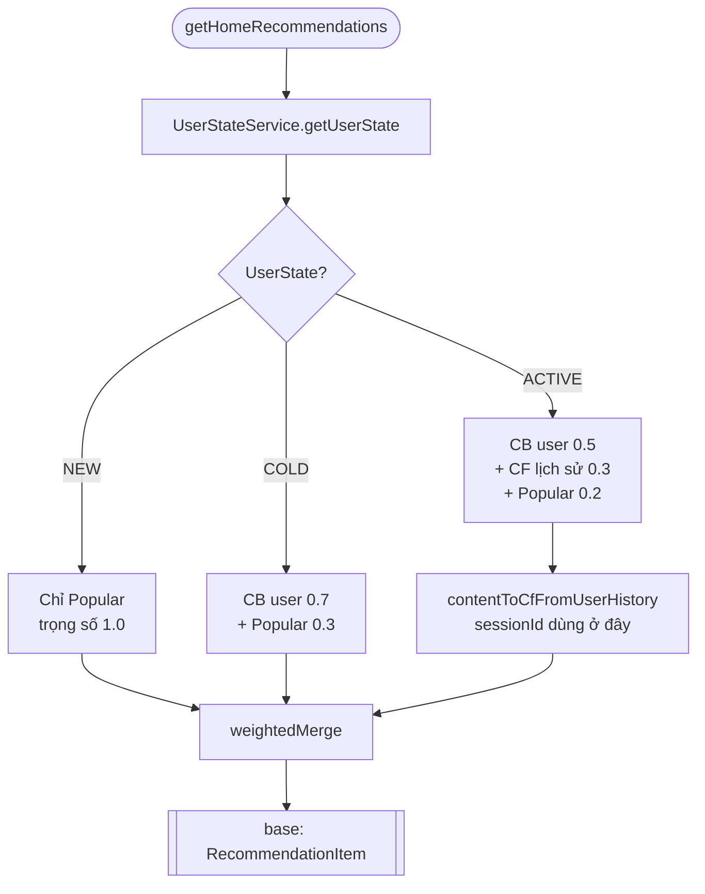
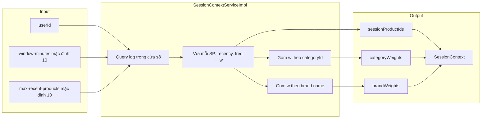
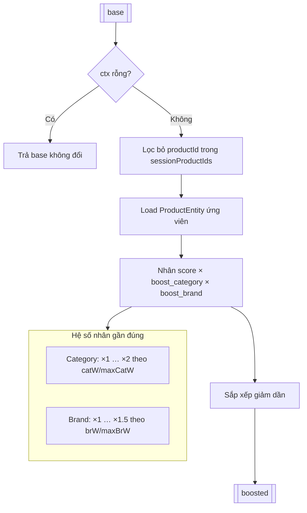
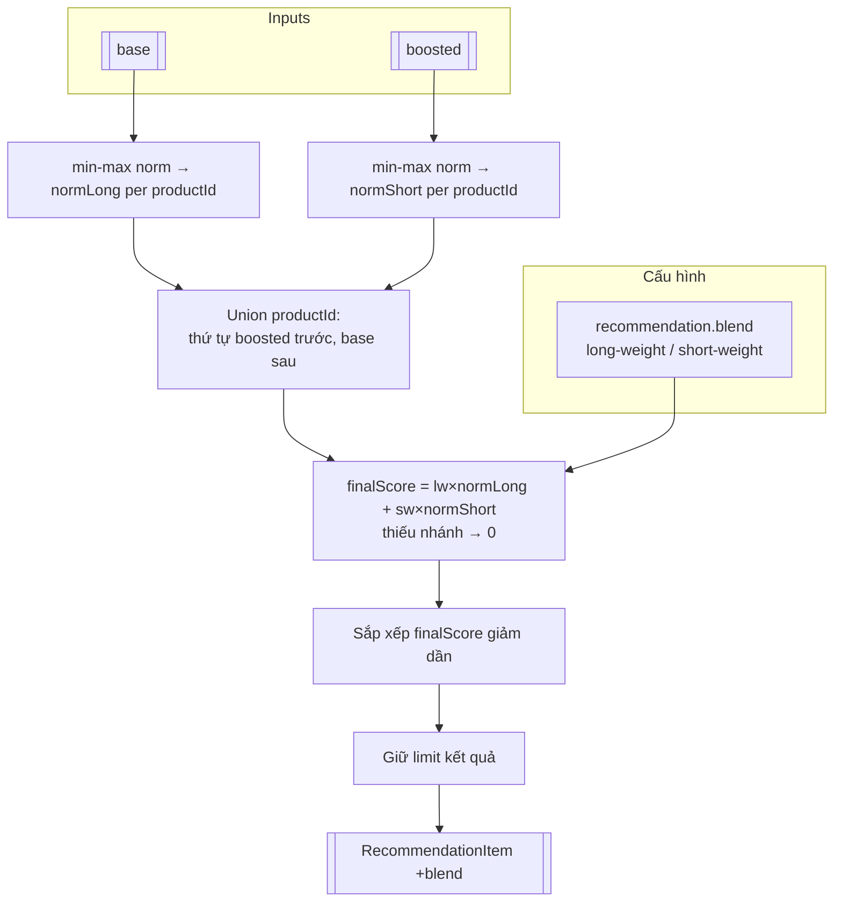
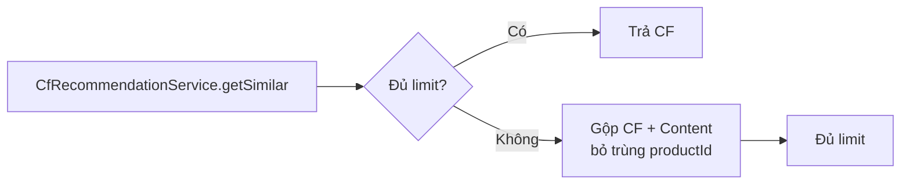
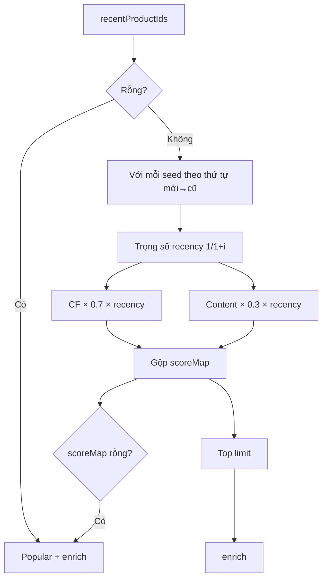

# Hệ thống Recommendation — Danh sách file và luồng nghiệp vụ

Tài liệu được sinh tự động từ mã nguồn backend `ecomx-be` (Spring Boot).

---

## 1. Tổng quan kiến trúc

Hệ thống kết hợp:

- **Collaborative Filtering (CF)** — độ tương đồng item–item từ bảng `ItemSimilarityEntity`, thuật toán `CF_COSINE`.
- **Content-based (item–item)** — tương tự CF nhưng dùng `CONTENT_TFIDF` trên cùng repository độ tương đồng.
- **Content-based theo user** — gợi ý theo user từ bảng `CbContentRecommendation` (danh sách product + similarity đã tiền xử lý).
- **Popularity** — sản phẩm phổ biến từ `PopularityRepository`.
- **Session context** — từ `CollectorLog`: boost theo category/brand trong cửa sổ thời gian gần đây (chủ yếu cho trang Home).

API trả về `ProductFullResponse` sau bước **enrichment** (join product + aggregate rating).

---

## 2. Danh sách file liên quan

### 2.1 Controller

| File | Vai trò |
|------|---------|
| `src/main/java/com/ndh/ShopTechnology/controller/recommendation/RecommendationController.java` | REST: `/home`, `/pdp/{productId}`, `/post-purchase/{productId}`, `POST /session` |

### 2.2 Service — interface

| File | Vai trò |
|------|---------|
| `services/recommendation/HybridRecommendationService.java` | Home, PDP tương tự, post-purchase |
| `services/recommendation/SessionBasedRecommendationService.java` | Gợi ý theo body session |
| `services/recommendation/RecommendationEnrichmentService.java` | `RecommendationItem` → `ProductFullResponse` |
| `services/recommendation/CfRecommendationService.java` | CF item–item |
| `services/recommendation/ContentItemRecommendationService.java` | Content TF–IDF item–item |
| `services/recommendation/CbContentRecommendationService.java` | Gợi ý content theo user |
| `services/recommendation/PopularityService.java` | Top popular |
| `services/recommendation/UserStateService.java` | Phân loại NEW / COLD / ACTIVE |
| `services/recommendation/SessionContextService.java` | Xây `SessionContext` từ log |

### 2.3 Service — implementation

| File | Vai trò |
|------|---------|
| `services/recommendation/impl/HybridRecommendationServiceImpl.java` | Trộn nguồn theo `UserState`, blend long/short, session boost |
| `services/recommendation/impl/SessionBasedRecommendationServiceImpl.java` | CF + content theo từng seed trong session, fallback popular |
| `services/recommendation/impl/RecommendationEnrichmentServiceImpl.java` | Load product + rating aggregate |
| `services/recommendation/impl/CfRecommendationServiceImpl.java` | `ItemSimilarityRepository` + cache `similarItemsCf` |
| `services/recommendation/impl/ContentItemRecommendationServiceImpl.java` | `similarItemsContent` |
| `services/recommendation/impl/CbContentRecommendationServiceImpl.java` | `userContentRecs` |
| `services/recommendation/impl/PopularityServiceImpl.java` | `popularItems` |
| `services/recommendation/impl/UserStateServiceImpl.java` | Đếm event user qua `CollectorLogRepository` |
| `services/recommendation/impl/SessionContextServiceImpl.java` | Log gần đây → weight category/brand |
| `services/recommendation/impl/SessionBooster.java` | Nhân score theo category/brand, loại SP đã xem trong session |

### 2.4 DTO / entity (recommendation)

| File | Vai trò |
|------|---------|
| `dto/response/recommendation/RecommendationItem.java` | `productId`, `score`, `source` |
| `dto/request/recommendation/SessionProfileRequest.java` | `sessionId`, `recentProductIds`, `cartProductIds`, `limit` |
| `dto/response/recommendation/CbContentRecommendationResponse.java` | Response có metadata (debug/PDP) |
| `dto/response/recommendation/CbContentRecommendationRankedItemResponse.java` | Item xếp hạng CB |
| `services/recommendation/dto/SessionContext.java` | Context session cho booster |
| `services/recommendation/dto/PopularProductRow.java` | Row popular từ query |
| `entities/recommendation/CbContentRecommendation.java` | Entity user → list product + similarity |
| `entities/recommendation/ItemSimilarityEntity.java` | source → target + similarity + algorithm |

### 2.5 Repository

| File | Vai trò |
|------|---------|
| `repository/ItemSimilarityRepository.java` | Top similar theo source + algorithm |
| `repository/CbContentRecommendationRepository.java` | Theo `userId` |
| `repository/PopularityRepository.java` | Top popular |
| `repository/CollectorLogRepository.java` | Log hành vi — dùng cho user state, session context, lịch sử gần đây |

### 2.6 Cấu hình

| File | Vai trò |
|------|---------|
| `config/RecommendationBlendProperties.java` | `recommendation.blend.long-weight`, `short-weight` (chuẩn hóa tổng = 1) |
| `config/CacheConfig.java` | Tên cache: `similarItemsCf`, `similarItemsContent`, `userContentRecs`, `popularItems` |

### 2.7 Khác (tham chiếu recommendation)

| File | Vai trò |
|------|---------|
| `constants/RecommendationAlgorithm.java` | Chuỗi nguồn: `cf_cosine`, `content_tfidf`, `content_user`, `popular` |
| `enums/UserState.java` | `NEW`, `COLD`, `ACTIVE` |
| `config/WebSecurityConfig.java` | Có thể cấu hình permit cho `/recommendations/**` (kiểm tra nếu cần) |

---

## 3. Luồng API (từ Controller)

Prefix API: `${api.prefix}/recommendations` (ví dụ `/api/v1/recommendations` tùy cấu hình).

```mermaid
flowchart TB
    subgraph endpoints [RecommendationController]
        H[GET /home]
        P[GET /pdp/{productId}]
        PP[GET /post-purchase/{productId}]
        S[POST /session]
    end

    H --> Hybrid[HybridRecommendationService]
    P --> Hybrid
    PP --> Hybrid
    S --> SessionSvc[SessionBasedRecommendationService]

    Hybrid --> Enrich[RecommendationEnrichmentService]
    SessionSvc --> Enrich2[RecommendationEnrichmentService trong SessionBased]

    Enrich --> PF[ProductFullResponse]
    Enrich2 --> PF
```

---

## 4. Nghiệp vụ chi tiết

### 4.1 GET `/home` — Trang chủ

1. **`UserStateService.getUserState(userId)`**  
   - Đếm tương tác qua `CollectorLogRepository.countByUserId`.  
   - `0` event → **NEW**; `1..9` → **COLD**; `≥10` → **ACTIVE**.  
   - `userId` null hoặc ≤ 0 → **NEW**.

2. **Chọn nguồn và trọng số** (`weightedMerge` sau khi gọi từng supplier):

   | UserState | Nguồn | Trọng số (tổng quy ước) |
   |-----------|--------|-------------------------|
   | NEW | `PopularityService.getPopularItems` | 1.0 |
   | COLD | CB user + Popular | 0.7 + 0.3 |
   | ACTIVE | CB user + CF từ lịch sử + Popular | 0.5 + 0.3 + 0.2 |

3. **CF từ lịch sử** (`contentToCfFromUserHistory`):  
   - Lấy tối đa 5 `productId` gần nhất từ `CollectorLogRepository.findRecentProductIdsByUser(userId, sessionId, 5)`.  
   - Với mỗi id, gọi `CfRecommendationService.getSimilar`, gộp theo `productId` (giữ score cao hơn), sort, limit.

4. **Session context + boost**:  
   - `SessionContextService.buildContext(userId)`: trong cửa sổ `recommendation.session.window-minutes` (mặc định 10 phút), tối đa `recommendation.session.max-recent-products` sản phẩm; tính weight recency × frequency; gom weight theo **category** và **brand**.  
   - `SessionBooster.boost(base, ctx)`: loại sản phẩm đã trong session; nhân score theo category (tối đa ~×2) và brand (tối đa ~×1.5).

5. **Blend long / short** (`blendLongShort`):  
   - **Long**: chuẩn hóa min–max score trên danh sách **trước** boost.  
   - **Short**: min–max trên danh sách **sau** boost.  
   - Điểm cuối: `longWeight * normLong + shortWeight * normShort` (từ `RecommendationBlendProperties`, mặc định 0.6 / 0.4 sau chuẩn hóa).  
   - Thứ tự ưu tiên: union theo thứ tự **boosted** trước rồi **base**; sort theo điểm blend; `limit`.

6. **`RecommendationEnrichmentService.enrich`**: map `productId` → `ProductFullResponse` + rating.

#### Chi tiết: `HybridRecommendationServiceImpl` — luồng Home, session, long / short

Chỉ **`getHomeRecommendations`** dùng đủ chuỗi: **base → `SessionContext` → `SessionBooster` → `blendLongShort`**. Các phương thức khác của hybrid (PDP, post-purchase) **không** qua session blend.

**Lưu ý tham số `sessionId`:**

- Được truyền vào **`contentToCfFromUserHistory`** (user **ACTIVE**) qua `CollectorLogRepository.findRecentProductIdsByUser(userId, sessionId, 5)`.
- **`SessionContextService.buildContext`** chỉ nhận **`userId`** — “session” ở đây là **cửa sổ thời gian trên log server**, không dùng UUID session từ FE.

**Bước 1 — `base`:** `weightedMerge` các supplier theo `UserState` (xem bảng mục 4.1), kết quả là danh sách `RecommendationItem` với score đã cộng trọng số nguồn.

**Bước 2 — Tính “session” (`SessionContextServiceImpl.buildContext`):**

- Query log trong **`recommendation.session.window-minutes`** (mặc định **10** phút), tối đa **`recommendation.session.max-recent-products`** dòng (mặc định **10**).
- Với mỗi sản phẩm đã tương tác trong cửa sổ, có `lastTs` và số lần `cnt`:
  - `minutesAgo` = phút từ `lastTs` đến hiện tại  
  - `recency = 1 / (1 + minutesAgo)` — càng mới càng lớn  
  - `freq = ln(1 + cnt)`  
  - **Trọng số sản phẩm:** `w = recency × (1 + freq)`
- **Gom** `w` theo **category** (`categoryId`) và **brand** (tên brand) bằng cộng dồn.
- **`SessionContext`** giữ: `sessionProductIds` (các `productId` đã tương tác trong cửa sổ), `categoryWeights`, `brandWeights`.  
- `userId == null` hoặc không có dòng log → context rỗng (maps rỗng, không boost).

**Bước 3 — `SessionBooster.boost(base, ctx)`:**

- Nếu `ctx` rỗng → trả **`base`** không đổi.
- Ngược lại: **loại** mọi item có `productId` ∈ `sessionProductIds` (tránh gợi ý lại SP vừa xem trong cửa sổ).
- Với từng ứng viên còn lại, load `ProductEntity`, tính hệ số nhân `boost` (nhân các thành phần):
  - `maxCatW` = max `categoryWeights`; `maxBrW` = max `brandWeights`.
  - **Category:** `boost *= 1 + (catW / maxCatW) × 1.0` → khoảng **×1 … ×2** khi khớp category mạnh nhất.
  - **Brand:** `boost *= 1 + (brW / maxBrW) × 0.5` → khoảng **×1 … ×1.5**.
- **Score mới** = `score_cũ × boost`. Sort giảm dần. Nếu `boost > 1.05` thì nối `+session` vào `source`.

**Bước 4 — Long / short (`blendLongShort(base, boosted, limit)`):**

| Tín hiệu | Nguồn | Ý nghĩa gần đúng |
|----------|--------|------------------|
| **Long** | Danh sách **`base`** (trước boost) | Gợi ý “dài hạn” / tổng hợp theo UserState + merge nguồn |
| **Short** | Danh sách **`boosted`** (sau boost) | Ưu tiên hành vi **rất gần** (category/brand trong cửa sổ phút) |

**Chuẩn hóa:** với mỗi danh sách, áp **min–max** trên toàn bộ `score` trong list đó:  
`norm = (score - min) / max(max - min, 1e-9)` → mỗi list một thang **[0, 1]** riêng.

**Điểm kết hợp** cho mỗi `productId` (xuất hiện trong union):

`finalScore = lw × normLong + sw × normShort`

- `normLong`: từ `base`; nếu `productId` không có trong `base` → **0**  
- `normShort`: từ `boosted`; nếu không có → **0**  
- `lw`, `sw`: `RecommendationBlendProperties` (`recommendation.blend.long-weight`, `short-weight`), mặc định **0.6 / 0.4**, sau `@PostConstruct` chuẩn hóa **`lw + sw = 1`**

**Thứ tự union:** `LinkedHashSet` — duyệt **`boosted` trước** (giữ thứ hạng sau boost), sau đó **`base`** (các id chưa gặp). `source` ưu tiên từ `boosted` rồi `base`, cuối cùng gắn **`+blend`**. Sort `finalScore` giảm dần, lấy **`limit`**.

**Trường hợp đặc biệt:**

- `boosted` null/rỗng → trả **`base`** cắt `limit` (không blend).  
- `base` null/rỗng → trả **`boosted`** cắt `limit`.

---

### 4.2 GET `/pdp/{productId}` — Sản phẩm tương tự (PDP)

1. Gọi **CF** `getSimilar(productId, limit, null)`.  
2. Nếu đủ `limit` → trả về.  
3. Nếu không đủ → **cascade**: giữ CF, bổ sung từ **Content item–item** (`ContentItemRecommendationService.getSimilar`) cho đủ `limit`, tránh trùng `productId`.

*(Tham số `userId`, `sessionId` trên controller hiện không được truyền xuống hybrid cho endpoint này trong implementation đã đọc.)*

---

### 4.3 GET `/post-purchase/{productId}` — Gợi ý sau mua

**Weighted merge** cố định:

- CF: trọng số **0.7**  
- Content item–item: **0.3**  

Mỗi nguồn lấy `limit * 2` ứng viên rồi gộp score (cộng có trọng số), sort, `limit`.

---

### 4.4 POST `/session` — Gợi ý theo session (body)

**`SessionBasedRecommendationServiceImpl.recommendForSession`**

1. `limit`: từ request, tối đa **50**, mặc định **20**.  
2. Nếu `recentProductIds` rỗng → **popular** + enrich → trả về.  
3. Ngược lại: build `exclude` = recent + cart.  
4. Với mỗi `seed` trong `recent` (theo thứ tự mới → cũ), trọng số recency `1/(1+i)`.  
5. Với mỗi seed:  
   - CF `getSimilar(seed, 20, exclude)` × **0.7** × recency  
   - Content `getSimilar(seed, 20, exclude)` × **0.3** × recency  
6. Gộp `scoreMap`, sort, top `limit`.  
7. Nếu không có ứng viên → fallback popular.  
8. **Enrich** ngay trong service (không qua controller).

---

## 6. Thuật toán và nguồn dữ liệu (implementation)

| Service | Nguồn DB | Cache |
|---------|----------|--------|
| `CfRecommendationServiceImpl` | `ItemSimilarityRepository.findTopBySource(..., CF_COSINE, ...)` | `similarItemsCf` |
| `ContentItemRecommendationServiceImpl` | Cùng bảng similarity, algorithm `CONTENT_TFIDF` | `similarItemsContent` |
| `CbContentRecommendationServiceImpl` | `CbContentRecommendation` theo `userId` | `userContentRecs` |
| `PopularityServiceImpl` | `PopularityRepository.findTopPopular` | `popularItems` (key `'all'`) |

---

## 7. Cấu hình ứng dụng (tham khảo)

- `recommendation.blend.long-weight` / `short-weight` — blend Home sau session boost.  
- `recommendation.session.window-minutes` — cửa sổ log cho `SessionContext` (mặc định 10).  
- `recommendation.session.max-recent-products` — số sản phẩm tối đa lấy từ log (mặc định 10).

---

## 8. Sơ đồ tổng quát Home (hybrid)



---

## 9. Sơ đồ chi tiết (Mermaid)

Các sơ đồ dưới đây mô tả trực quan luồng trong code; render tốt trên GitHub, VS Code (Markdown Preview Mermaid), hoặc các công cụ hỗ trợ Mermaid.

### 9.1 Luồng GET `/home` — sequence (thứ tự gọi)



### 9.2 Chọn nguồn theo `UserState` → `base`



### 9.3 Xây `SessionContext` từ log (cửa sổ phút)



### 9.4 `SessionBooster`: từ `base` → `boosted`



### 9.5 Blend long / short (`blendLongShort`)



### 9.6 GET `/pdp` — cascade CF → Content



### 9.7 POST `/session` — gợi ý theo `recentProductIds`



---

*Tài liệu phản ánh cấu trúc package và luồng điều khiển trong mã nguồn; khi refactor service hãy cập nhật file này cho đồng bộ.*
